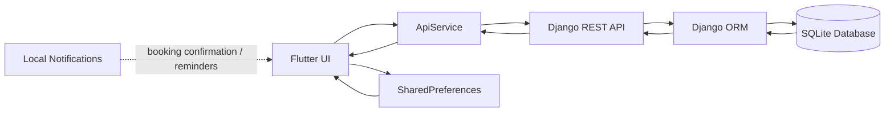

# Ashray Project Developer Guide

This document explains the project end to end in developer language, but with simple wording.

Project stack:
- Frontend: Flutter (Dart)
- Backend: Django + Django REST Framework
- API style: REST over HTTP
- Database: SQLite in development

---

## 1. Project Overview

### High-level architecture

The project is a mobile health application with a Flutter client and a Django API server.

The flow is:

Flutter UI -> ApiService -> Django REST API -> Django ORM -> SQLite database

Then the response comes back in the opposite direction:

SQLite database -> Django ORM -> DRF serializer -> JSON response -> Flutter state update -> UI rebuild

### What each layer does

- Flutter handles screens, user interaction, local state, file picking, notifications, and GPS.
- Django handles authentication, business rules, validation, database access, and file storage.
- The API is the contract between both sides.
- SQLite stores users, appointments, medications, reports, doctor availability, and SOS logs.

### End-to-end data flow example

When a patient books a doctor:
1. The user taps a booking button in Flutter.
2. Flutter opens a booking dialog and collects date, time, and reason.
3. Flutter sends a POST request to `/api/appointments/`.
4. Django validates the payload using `AppointmentSerializer`.
5. Django checks the doctor exists and is active.
6. Django checks seat capacity using `DoctorDayAvailability` and existing appointments.
7. Django saves the appointment in the database.
8. Django returns the created appointment as JSON.
9. Flutter adds it to local state.
10. Flutter shows an immediate booking notification.

---

## 2. Flutter Side Deep Dive

### Folder structure

The Flutter code follows a feature-first structure under `Frontend/lib/src`.

- `main.dart`: app entry point.
- `src/app.dart`: root widget, providers, routes.
- `src/theme`: global theme and design system.
- `src/core`: shared services, config, constants, network helpers, reusable widgets.
- `src/features/auth`: login, register, token storage, auth state.
- `src/features/health`: dashboard data state and refresh logic.
- `src/features/home`: shell navigation and feature screens.

This structure is good because feature code stays together. For example, all booking-related UI and logic are in the home/schedule area, and auth logic stays in the auth folder.

### Flutter programming model used here

#### Widgets

The app uses Flutter widgets everywhere.

- `StatelessWidget` is used for screens or components that only depend on incoming data or providers.
- `StatefulWidget` is used when a screen has local UI state, like form fields, selected dates, toggles, or dialogs.

Examples:
- `SplashScreen` is stateful because it watches session state and redirects.
- `LoginScreen` is stateful because it manages password visibility and form fields.
- `MainShell` is stateful because it controls the selected tab.
- `HomePage` is stateless because it only chooses doctor vs patient dashboard.

#### State management

The project uses `Provider` with `ChangeNotifier`.

Controllers:
- `AuthController`
- `HealthController`

How it works:
- Controllers hold app state.
- Screens read them with `context.watch()` when they need to rebuild.
- Screens call actions with `context.read()` when they need to trigger network requests or updates.

This is a good fit for a medium-size app because the pattern is simple and easy to trace.

#### Navigation

Navigation is a mix of:
- Named routes for app-level screens.
- `Navigator.push(...)` for feature screens opened from tabs.
- `pushNamedAndRemoveUntil(...)` for auth redirects.

Route setup is in `src/app.dart`.

Main routes:
- `/` -> SplashScreen
- `/login` -> LoginScreen
- `/create-account` -> CreateAccountScreen
- `/home` -> HomePage

The main patient UI is a bottom navigation shell in `MainShell`.

#### API calling

The app uses the `http` package, not Dio.

All network code goes through `ApiService`.

What `ApiService` does:
- builds URLs from `AppConfig.baseUrl`
- sends JSON requests
- adds the `Authorization: Token <token>` header when needed
- handles timeouts, socket errors, and client errors
- converts responses into Dart maps or lists

#### Model classes and JSON parsing

The app uses light model classes only for auth:
- `AuthUser`
- `AuthResponse`

For most other endpoints, the app uses `Map<String, dynamic>` instead of strict models.

This is easier for fast development, but the tradeoff is less compile-time safety.

### Flutter app bootstrap

Files:
- `lib/main.dart`
- `lib/src/app.dart`

Startup flow:
1. `main()` calls `WidgetsFlutterBinding.ensureInitialized()`.
2. `NotificationService.instance.initialize()` runs.
3. `runApp(const VedaApp())` starts the app.
4. `VedaApp` creates providers for auth and health.
5. The app opens `SplashScreen` first.

### Feature-by-feature flow

#### Login and registration

Screens and files:
- `src/features/auth/presentation/splash_screen.dart`
- `src/features/auth/presentation/login_screen.dart`
- `src/features/auth/presentation/create_account_screen.dart`
- `src/features/auth/presentation/auth_controller.dart`
- `src/features/auth/data/token_storage.dart`

Login flow:
1. User enters email and password.
2. `LoginScreen` validates the form.
3. It calls `AuthController.login()`.
4. `AuthController` calls `ApiService.login()`.
5. `ApiService` POSTs to `/auth/login/`.
6. Django returns token plus user JSON.
7. `AuthController` stores the token in SharedPreferences.
8. The app moves to `/home`.

Registration flow:
1. User fills the create account form.
2. `CreateAccountScreen` sends all entered profile fields.
3. `AuthController.register()` calls `ApiService.register()`.
4. `ApiService` POSTs to `/auth/register/`.
5. Django creates the user and returns token plus user JSON.
6. The token is saved locally.
7. The app moves to `/home`.

Important detail:
- Login role switching is enforced in Flutter by the selected login mode.
- The backend itself mainly trusts the stored role and the returned user profile.

#### Patient home and shell navigation

Files:
- `src/features/home/presentation/home_page.dart`
- `src/features/home/presentation/main_shell.dart`
- `src/features/home/presentation/screens/home_dashboard_screen.dart`

Flow:
1. `HomePage` checks the user role from `AuthController`.
2. Doctors go to `DoctorDashboardScreen`.
3. Patients go to `MainShell`.
4. `MainShell` shows 5 bottom tabs.
5. The Home tab acts as a launcher for sub-features.

Tabs:
- Home
- Schedule
- Reports
- SOS
- Profile

#### Medication feature

Files:
- `src/features/home/presentation/screens/medication_screen.dart`
- `src/features/health/presentation/health_controller.dart`
- `src/core/services/notification_service.dart`

How it works:
1. Screen loads medications from `HealthController.fetchMedications()`.
2. `HealthController` calls `/medications/`.
3. The backend returns the user’s medication list.
4. Flutter shows cards for each medication.
5. The user can add a medication using a dialog.
6. `HealthController.addMedication()` POSTs to `/medications/`.
7. After success, reminder notifications are resynced locally.

Important note:
- `Mark as Taken` is only local UI state right now.
- The backend stores medication records, but “taken today” is not saved to the database.

#### Schedule and booking feature

Files:
- `src/features/home/presentation/screens/schedule_screen.dart`
- `src/features/health/presentation/health_controller.dart`
- `src/core/services/notification_service.dart`

How it works:
1. Patient opens Schedule.
2. The screen fetches doctors for the selected date.
3. It shows a booking dialog.
4. The user selects doctor, date, time, and reason.
5. Flutter calls `HealthController.addAppointment()`.
6. The controller POSTs to `/appointments/`.
7. Django checks the doctor, seat limit, and day availability.
8. The appointment is stored.
9. Flutter immediately shows the booking confirmation notification.
10. Appointment reminder notifications are also synced locally.

#### Find doctor feature

Files:
- `src/features/home/presentation/screens/find_doctor_screen.dart`
- `src/features/health/presentation/health_controller.dart`

How it works:
1. Flutter fetches doctors from `/doctors/`.
2. It filters them by area, category, search text, and selected date.
3. The screen also merges in hardcoded seed doctors for demo UI polish.
4. Booking from this screen still uses the backend appointment endpoint.

Important detail:
- Rating and distance shown in the cards are demo data from Flutter, not backend data.

#### Doctor dashboard feature

Files:
- `src/features/home/presentation/screens/doctor_dashboard_screen.dart`
- `src/features/health/presentation/health_controller.dart`

How it works:
1. The doctor opens the dashboard.
2. Flutter loads day status using `/doctor/day-status/?date=YYYY-MM-DD`.
3. Flutter loads doctor appointments using `/doctor/appointments/?date=YYYY-MM-DD`.
4. The doctor can mark the day as full or available.
5. The doctor can edit the daily seat limit.
6. Flutter POSTs the changes to `/doctor/day-status/`.
7. Django updates or creates the availability row.

#### Reports feature

Files:
- `src/features/home/presentation/screens/reports_screen.dart`
- `src/features/home/presentation/screens/add_report_screen.dart`
- `src/features/health/presentation/health_controller.dart`

How it works:
1. Patient opens reports screen.
2. Flutter fetches `/reports/`.
3. Reports are filtered and searchable on the client.
4. Add Report screen lets the user choose a file from camera or file picker.
5. Flutter sends multipart form data to `/reports/`.
6. Django stores the uploaded file in `media/reports/`.
7. Flutter opens the file URL using `url_launcher`.

#### Digital prescription feature

Files:
- `src/features/home/presentation/screens/digital_prescription_screen.dart`

How it works:
1. User captures or selects a file.
2. User enters title, date, and notes.
3. The screen saves the list in SharedPreferences.
4. This is local-only storage.

This feature is not backed by Django at the moment.

#### SOS feature

Files:
- `src/features/home/presentation/screens/sos_screen.dart`
- `src/features/health/presentation/health_controller.dart`

How it works:
1. Flutter tries to get GPS location using `geolocator`.
2. It builds a Google Maps link from the current coordinates.
3. Flutter POSTs the SOS event to `/sos-logs/trigger/`.
4. Django stores the SOS log.
5. Django tries to match emergency phone numbers to users.
6. Flutter opens an SMS draft to the emergency contacts.

#### Health dashboard feature

Files:
- `src/features/home/presentation/screens/health_dashboard_screen.dart`

How it works:
1. The screen reads the current profile from `AuthController.user`.
2. It displays BP, sugar, heart rate, and weight.
3. It calculates simple status labels like low, normal, or high.
4. The chart is a visual summary based on profile values, not live history from the backend.

#### Notifications and sensor lab

Files:
- `src/features/home/presentation/screens/notification_simulator_screen.dart`
- `src/features/home/presentation/screens/sensor_simulation_screen.dart`
- `src/core/services/notification_service.dart`

Notification simulator:
- Builds reminder cards from already fetched appointments and medications.
- It is a UI preview of reminders, not the actual scheduling engine.

Sensor lab:
- Uses accelerometer data from `sensors_plus`.
- Uses SharedPreferences for hydration state.
- Generates in-app alerts for movement, fall risk, and water intake.

### Flutter async behavior

This app uses `Future`, `async`, and `await` heavily.

Examples:
- fetch user profile after token restore
- load medications from API
- upload reports with multipart request
- schedule notifications after a successful booking

This matters because most app actions are not instant. The UI must show loading state while waiting for network or storage work.

---

## 3. Django Backend Deep Dive

### Backend folder structure

- `config`: project settings and root URL routing.
- `core`: app with models, serializers, views, managers, admin, and migrations.
- `media`: uploaded report files.
- `manage.py`: Django command entrypoint.

### Django architecture used here

This backend uses Django’s MVT style:

- Model: database structure and business data.
- View: request handling and business logic.
- Template: not used here because the app is API-first.

### Models

File: `Backend/core/models.py`

#### User

Custom user model with email login.

Important fields:
- email
- full_name
- phone
- date_of_birth
- blood_group
- emergency_contact_name
- emergency_contact_phone
- bp_reading
- sugar_level
- heart_rate
- weight
- role
- doctor_category
- doctor_area
- doctor_city
- daily_seat_limit

Why custom user matters:
- The app needs roles and medical profile fields.
- Django’s default user model does not fit this use case well.

#### Medication

Stores medication details for a user:
- name
- dosage
- frequency
- reminder_time
- start_date
- end_date
- notes
- is_active

#### Appointment

Stores the booking relationship between a patient and a doctor.

Important fields:
- user
- doctor
- doctor_name
- specialty
- hospital_name
- appointment_date
- appointment_time
- reason
- status

#### DoctorDayAvailability

Stores booking capacity for one doctor on one date.

Fields:
- doctor
- date
- seat_limit
- is_full
- doctor_marked_full

This model is the key to preventing overbooking.

#### MedicalReport

Stores uploaded report metadata and file path.

#### SOSLog

Stores emergency triggers with coordinates, message, and status.

### Serializers

File: `Backend/core/serializers.py`

Serializers convert model instances into JSON and validate incoming data.

#### UserSerializer

Used for profile response and profile update.

#### RegisterSerializer

Validates registration payload.

Rules:
- password must be at least 8 characters
- doctors must provide category, area, and city
- patients should not carry doctor-only fields

#### LoginSerializer

Uses Django `authenticate()` with email and password.

#### MedicationSerializer

Full model serializer for medication records.

#### AppointmentSerializer

Important logic:
- accepts `doctor_id` on create
- looks up the doctor user
- auto-fills doctor_name, specialty, and hospital_name
- returns patient and doctor display fields

#### DoctorListSerializer

Adds computed fields:
- seats_booked
- seats_remaining
- is_full_for_date

It calculates booking state based on the selected date.

#### DoctorDayAvailabilitySerializer

Adds computed seat counts for a single doctor/date slot.

#### MedicalReportSerializer

Handles upload and metadata for reports.

#### SOSLogSerializer

Handles emergency logs.

### Views / ViewSets

File: `Backend/core/views.py`

#### health

Simple GET endpoint for backend availability.

#### register_view

Creates user, returns token and user JSON.

#### login_view

Authenticates user, returns token and user JSON.

#### logout_view

Deletes the user token if one exists.

#### me_view

GET returns the current user.
PATCH updates profile fields.

#### MedicationViewSet

CRUD for medication records owned by the current user.

#### AppointmentViewSet

CRUD for appointments.

Special rules:
- patients can create appointments
- doctors see only their own appointments
- patients see only their own appointments
- create checks seat availability atomically
- delete recalculates full/available state

#### DoctorViewSet

Lists active doctors with optional filters:
- area
- category
- city
- date

#### MedicalReportViewSet

CRUD for uploaded reports.

#### SOSLogViewSet

CRUD for SOS logs.

Special `trigger` action:
- creates SOS log
- parses emergency contact phones
- creates follow-up SOS logs for matched contacts

#### doctor_day_status_view

GET or POST for a doctor’s date availability.

#### doctor_appointments_view

Doctor-only endpoint for listing booked appointments.

### URLs / routers

File: `Backend/core/urls.py`

Exposed endpoints:
- `/api/health/`
- `/api/auth/register/`
- `/api/auth/login/`
- `/api/auth/logout/`
- `/api/auth/me/`
- `/api/doctor/day-status/`
- `/api/doctor/appointments/`
- `/api/medications/`
- `/api/appointments/`
- `/api/reports/`
- `/api/sos-logs/`
- `/api/doctors/`

### Django settings that matter

File: `Backend/config/settings.py`

Important pieces:
- `AUTH_USER_MODEL = 'core.User'`
- SQLite database
- `rest_framework.authtoken`
- CORS enabled for Flutter development URLs
- media files stored under `media/`

### Django middleware / request pipeline

Relevant middleware includes:
- SecurityMiddleware
- CorsMiddleware
- SessionMiddleware
- CommonMiddleware
- CsrfViewMiddleware
- AuthenticationMiddleware

For API auth, token authentication is what matters most in this app.

---

## 4. API Integration

### Authentication APIs

#### POST `/api/auth/register/`

Request example:
```json
{
  "full_name": "John Doe",
  "email": "john@example.com",
  "phone": "9999999999",
  "password": "password123",
  "date_of_birth": "1990-01-01"
}
```

Response example:
```json
{
  "token": "abc123",
  "user": {
    "id": 1,
    "email": "john@example.com",
    "full_name": "John Doe",
    "role": "patient"
  }
}
```

#### POST `/api/auth/login/`

Request:
```json
{
  "email": "john@example.com",
  "password": "password123"
}
```

Response:
Same shape as register.

#### GET `/api/auth/me/`

Returns current user profile.

#### PATCH `/api/auth/me/`

Updates profile fields.

### Medication APIs

#### GET `/api/medications/`

Returns a list of the user’s medications.

#### POST `/api/medications/`

Request example:
```json
{
  "name": "Paracetamol",
  "dosage": "500mg",
  "frequency": "Twice a day",
  "reminder_time": "08:00:00",
  "start_date": "2026-04-29",
  "is_active": true
}
```

### Appointment APIs

#### GET `/api/appointments/`

Returns current user’s appointments.

#### POST `/api/appointments/`

Request example:
```json
{
  "doctor_id": 4,
  "appointment_date": "2026-04-30",
  "appointment_time": "10:30:00",
  "reason": "Follow-up"
}
```

#### DELETE `/api/appointments/{id}/`

Deletes an appointment.

### Doctor APIs

#### GET `/api/doctors/`

Optional query parameters:
- area
- category
- city
- date

#### GET `/api/doctor/day-status/?date=YYYY-MM-DD`

Returns the doctor’s date capacity state.

#### POST `/api/doctor/day-status/`

Updates seat limit and full/available state.

#### GET `/api/doctor/appointments/?date=YYYY-MM-DD`

Returns the doctor’s bookings for that day.

### Reports APIs

#### GET `/api/reports/`

Returns report metadata and file URLs.

#### POST `/api/reports/`

Multipart upload with fields:
- title
- report_type
- report_date
- notes
- file

#### DELETE `/api/reports/{id}/`

Deletes a report record and file reference.

### SOS API

#### POST `/api/sos-logs/trigger/`

Request example:
```json
{
  "message": "Need immediate help | https://maps.google.com/?q=19.123456,72.123456",
  "latitude": 19.123456,
  "longitude": 72.123456
}
```

---

## 5. Special Features Breakdown

### Booking system

Full flow:
1. Patient chooses a doctor.
2. Flutter opens a booking dialog.
3. `HealthController.addAppointment()` sends the payload.
4. `ApiService.addAppointment()` POSTs to Django.
5. `AppointmentSerializer` validates `doctor_id`.
6. `AppointmentViewSet.perform_create()` checks role, seat capacity, and availability.
7. If the slot is open, the appointment is saved.
8. Response comes back as JSON.
9. Flutter updates the local list.
10. Flutter shows an immediate booking notification.

Why this is important:
- The business rule is not only in the UI.
- The backend is the real source of truth for seat limits.

### Medication reminder system

There are two parts:

#### Part 1: data

Medication records are stored in the backend with start date, end date, reminder time, and active flag.

#### Part 2: local scheduling

Flutter uses `flutter_local_notifications` to schedule reminders on the device.

How it works:
1. Medication list is fetched from the backend.
2. `HealthController` asks `NotificationService` to sync reminders.
3. The service cancels old reminder IDs.
4. It computes future reminder times using timezone-aware scheduling.
5. It stores scheduled IDs in SharedPreferences.

Why notifications can appear delayed if the code is wrong:
- timezone not initialized
- exact alarm permission missing
- reminders rescheduled too often
- device battery restrictions

The current code now initializes timezone data and serializes reminder sync to reduce races.

### Authentication

Auth stack:
- Django custom user model
- token authentication
- SharedPreferences token storage
- `AuthController` session restore

Flow:
1. Register or login returns token.
2. Flutter stores token locally.
3. App restarts and restores token.
4. Flutter calls `/auth/me/`.
5. If valid, app continues.
6. If invalid, token is cleared.

---

## 6. Libraries and External Services

### Flutter packages

#### `http`
Used for REST API calls.

Alternative:
- `dio` offers more features, interceptors, and progress handling.

Tradeoff:
- `http` is simpler.
- `dio` is more powerful but heavier.

#### `provider`
Used for app state management.

Alternative:
- Riverpod
- Bloc

Tradeoff:
- Provider is easy to read and small.
- Riverpod and Bloc are stronger for very large apps.

#### `shared_preferences`
Used for token storage and some local app state.

Tradeoff:
- Simple and fast.
- Not suitable for secure secrets or large structured data.

#### `image_picker`
Used for camera capture.

#### `file_picker`
Used for choosing PDFs and files from storage.

#### `url_launcher`
Used to open report files and SMS intents.

#### `geolocator`
Used for current location in SOS.

#### `flutter_local_notifications`
Used for local reminders and booking notifications.

#### `timezone` and `flutter_timezone`
Used so scheduled notifications fire at correct local times.

#### `sensors_plus`
Used in the sensor simulation lab.

#### `cupertino_icons`
Basic icon support.

### Django packages

#### `Django`
Core backend framework.

#### `djangorestframework`
Builds REST APIs and serializers.

#### `django-cors-headers`
Allows the Flutter app to call the API during development.

#### `python-dotenv`
Loads environment variables from `.env`.

#### `rest_framework.authtoken`
Provides token-based authentication.

### External services / platform APIs

- Android location permissions via `geolocator`
- Android notifications via `flutter_local_notifications`
- SMS intent via `url_launcher`
- Camera and file picker integration from mobile OS

---

## 7. Core Concepts You Should Know

### Flutter concepts

#### Widget lifecycle

For `StatefulWidget`:
- `createState()` creates the state object.
- `initState()` runs once.
- `didChangeDependencies()` runs when inherited widgets change.
- `build()` runs often.
- `dispose()` cleans up controllers, timers, and subscriptions.

This app uses these lifecycle methods in screens like login, schedule, doctor dashboard, and sensor lab.

#### `build()` method

`build()` describes the UI based on current state.

If state changes and `notifyListeners()` or `setState()` runs, `build()` can run again.

#### Async programming

- `Future` means a value that will arrive later.
- `async` and `await` make asynchronous code easier to read.

This is used for API calls, storage, notifications, and file uploads.

### Django concepts

#### MVT architecture

- Model = database structure
- View = request handling and logic
- Template = not used here because this is API-first

#### ORM

The Django ORM turns Python model operations into SQL.

Examples:
- `Appointment.objects.filter(...)`
- `DoctorDayAvailability.objects.get_or_create(...)`
- `Token.objects.get_or_create(...)`

#### Middleware

Middleware processes requests before views and responses after views.

This project uses middleware for security, CORS, CSRF, sessions, and authentication.

### API concepts

#### REST principles

Resources are exposed as endpoints:
- users
- medications
- appointments
- reports
- SOS logs

#### Status codes

Common codes in this app:
- `200 OK`
- `201 Created`
- `400 Bad Request`
- `401 Unauthorized`
- `403 Forbidden`

#### Authentication types

This project uses token authentication, not JWT.

Token auth means:
- login returns a token string
- Flutter sends `Authorization: Token <token>`
- Django validates that token on each request

---

## 8. Trace Execution: Appointment Booking

This is the most important feature trace.

### Step-by-step trace

1. User taps Book on the doctor card.
2. `FindDoctorScreen` or `ScheduleScreen` opens a dialog.
3. The dialog collects doctor, date, time, and reason.
4. The screen calls `HealthController.addAppointment()`.
5. `HealthController` calls `ApiService.addAppointment()`.
6. `ApiService` sends POST `/api/appointments/`.
7. Django `AppointmentSerializer` validates the data.
8. `AppointmentViewSet.perform_create()` checks:
   - user role is patient
   - doctor exists and is active
   - day availability exists or is created
   - seat limit is not exceeded
9. The appointment is saved in SQLite.
10. Django returns JSON for the created appointment.
11. Flutter inserts the appointment into `_appointments`.
12. `NotificationService.scheduleAppointmentBookedNotification()` shows an immediate local notification.
13. `NotificationService.syncAppointmentReminders()` updates future reminders.
14. UI shows success message.

### Why this flow is good

- UI is responsive because Flutter updates local state immediately.
- Server rules still protect capacity.
- User gets a confirmation notification right away.

---

## 9. Debugging Guide

### Where errors usually happen

#### Flutter side

- wrong API base URL
- token missing or expired
- JSON shape mismatch
- file picker returns null path
- notifications permission denied
- timezone not initialized
- background reminders cancelled by repeated sync

#### Django side

- serializer validation failure
- role mismatch
- database lock or seat limit conflict
- CORS misconfiguration
- missing media path for report files

### How to debug Flutter + Django integration

1. Check token state in `AuthController`.
2. Confirm the API base URL in `AppConfig`.
3. Verify backend is running on `0.0.0.0:8000` or the correct LAN IP.
4. Inspect response messages from `ApiException`.
5. Check Django logs for serializer or permission errors.
6. Confirm the mobile device/emulator can reach the backend.

### Common mistakes

- Posting JSON without `Content-Type: application/json`.
- Forgetting to send the token header.
- Using `127.0.0.1` from a physical phone instead of your PC LAN IP.
- Not granting notification permission on Android 13+.
- Expecting local reminder code to survive app uninstall without resync.

### Notification-specific debugging

If notifications are delayed or missing, check:
- notification permission
- exact alarm permission
- timezone initialization
- device battery optimization
- whether the app resynced reminders too often
- whether the appointment time is already in the past

---

## 10. Mermaid Diagram



---

## 11. Important Practical Notes

- The project is API-first, so Django is the source of truth for user, booking, and report data.
- The app mixes real backend features with some local-only demo features, like the digital prescription vault and sensor lab.
- The booking capacity logic is enforced on the backend, which is the correct place for it.
- Notification scheduling is local on the phone, so it depends on Android/iOS permissions and device behavior.

---

## 12. Files to Read Next

If you want to study the code directly, start here:

- `Backend/config/settings.py`
- `Backend/core/models.py`
- `Backend/core/serializers.py`
- `Backend/core/views.py`
- `Frontend/lib/src/app.dart`
- `Frontend/lib/src/core/network/api_service.dart`
- `Frontend/lib/src/features/auth/presentation/auth_controller.dart`
- `Frontend/lib/src/features/health/presentation/health_controller.dart`
- `Frontend/lib/src/core/services/notification_service.dart`
- `Frontend/lib/src/features/home/presentation/main_shell.dart`

---

## 13. Final Mental Model

Remember the project like this:

1. Flutter collects user input and renders the UI.
2. `ApiService` sends the request to Django.
3. Django validates, applies rules, and stores or reads data.
4. Django responds with JSON or file URLs.
5. Flutter updates local state and may schedule local notifications.

That is the complete loop.